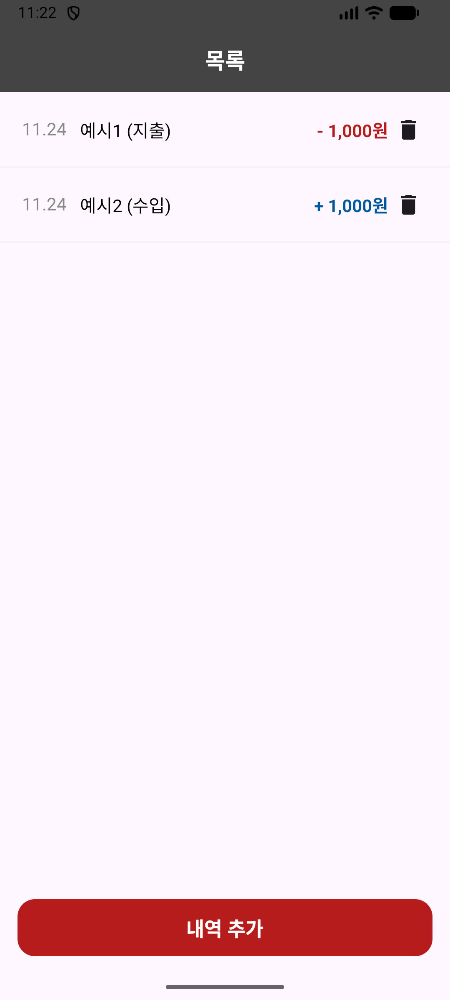
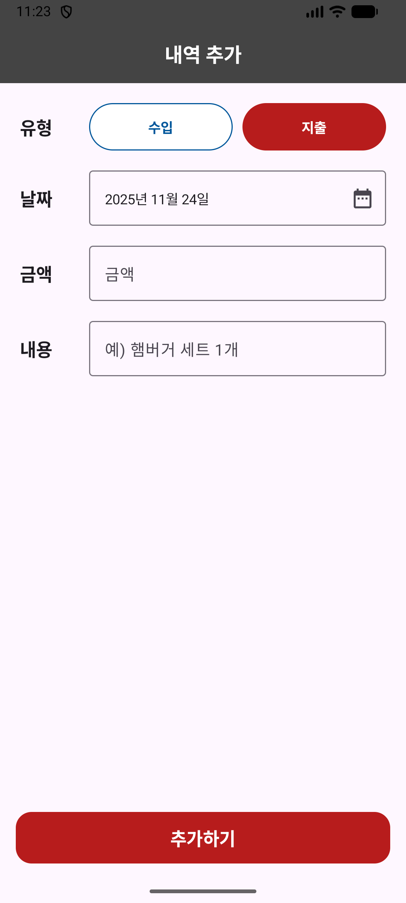

# expense-tracker-kotlin
---

## 개요

- 수입/지출 내역을 기록할 수 있는 간단한 Android 기반 가계부 애플리케이션

- Kotlin과 Android 관련 개념(Jetpack Compose, ViewModel, Room DB 등)을 학습하며 CRUD을 구현하고자함

- CRUD중 Update는 미구현 상태

### 앱 화면 스크린 샷

| 메인 목록 (List) | 내역 등록 (Add) |
|:---:|:---:|
|  |  |

## 환경

- Language: Kotlin
- UI: Jetpack Compose
- Architecture: MVVM
- Database: Room
- Minimum SDK: API 26
- Target SDK: API 34

---

## 기능 구현

- 내역 등록
    - 수입/지출 유형, 날짜, 금액, 내용을 입력하여 새로운 내역 저장
- 내역 조회
    - 내역 목록 화면에서 저장된 내역을 날짜 내림차순으로 리스트 형태로 조회
- 내역 삭제
    - 해당 내역의 삭제 버튼을 통해 데이터 삭제 가능

## 데이터 구조

가계부 내역을 저장하기 위해 `Room Database`에 정의한 데이터 모델`TransactionLog`

| 필드명 (Field) | 타입 (Type)       | 설명 (Description)                |
|:------------|:----------------|:--------------------------------|
| **id**      | `Long`          | 데이터의 고유 ID (Room에서 자동으로 생성)     |
| **type**    | `Enum`          | 수입(`INCOME`) / 지출(`EXPENSE`) 구분 |
| **amount**  | `Long`          | 금액                              |
| **content** | `String`        | 내역에 대한 메모 또는 설명                 |
| **date**    | `LocalDateTime` | 거래가 발생한 날짜와 시간                  |

---

## 구현 예정

- 내역 수정
- 월별 보기
- 월별 통계
- 카테고리 지정